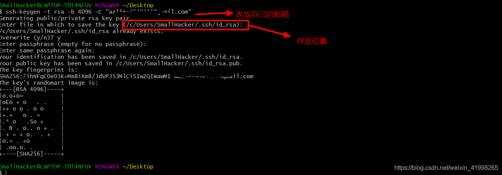

##1、目的

本自动化程序致力于git自动获取rsa秘钥，包括windows、Mac、linux等平台的秘钥自动化产生，其中linux平台下通过使用ssh-copy-id命令根据命令行参数可自动将ssh-public秘钥上传值指定服务器端

参考链接(不一定能访问到):http://cncc.bingj.com/cache.aspx?q=python+ssh-keygen&d=4719250172872345&mkt=zh-CN&setlang=en-GB&w=cfkzzkNKKC5iEUKiwT9JThqGx-ZzSqjw

##2、Windows10下github生成SSH公钥
1. 安装git，从程序目录打开 “Git Bash” ,
2. ssh-keygen -t rsa -C "email@email.com" ,email@email.com是自己github账号
3. 提醒你输入key的名称，你可以不用输入，一路回车，就OK了；
4. 一般会在用户目录下生成三个文件，例如我生成的文件在C:\Users\SmallHacker\.ssh目录下；
5,进入该用户的目录下用命令cat id_rsa.pub打开文件并复制里面的全部内容；
6,打开github账号–>Settings–>SSH and GPG keys–>New SSH key,并把复制好的内容全部粘贴进去" ；

